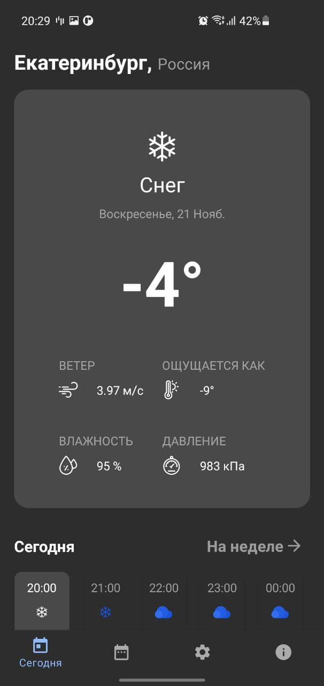
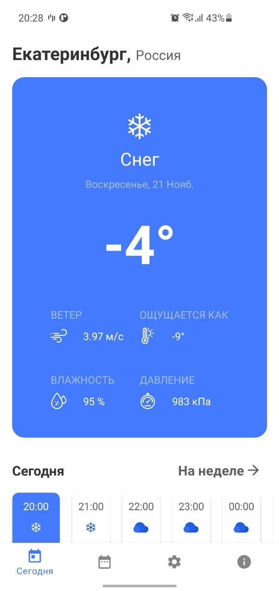
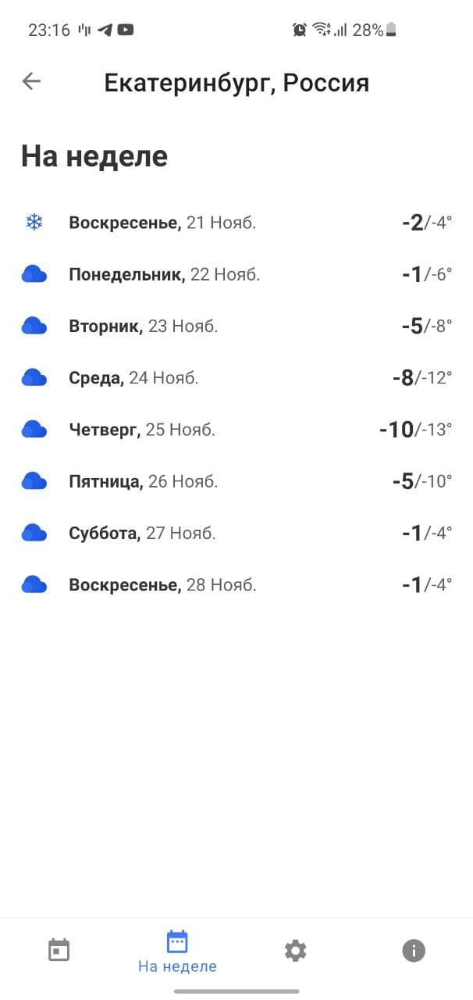
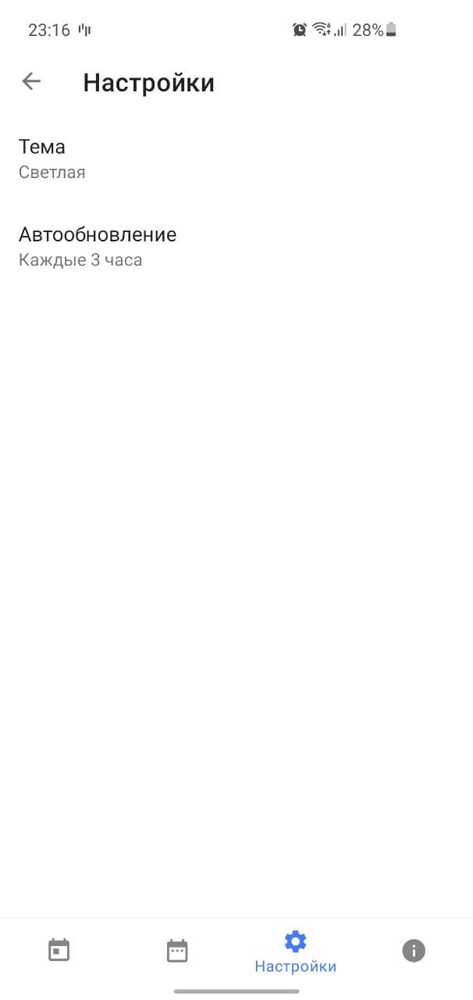
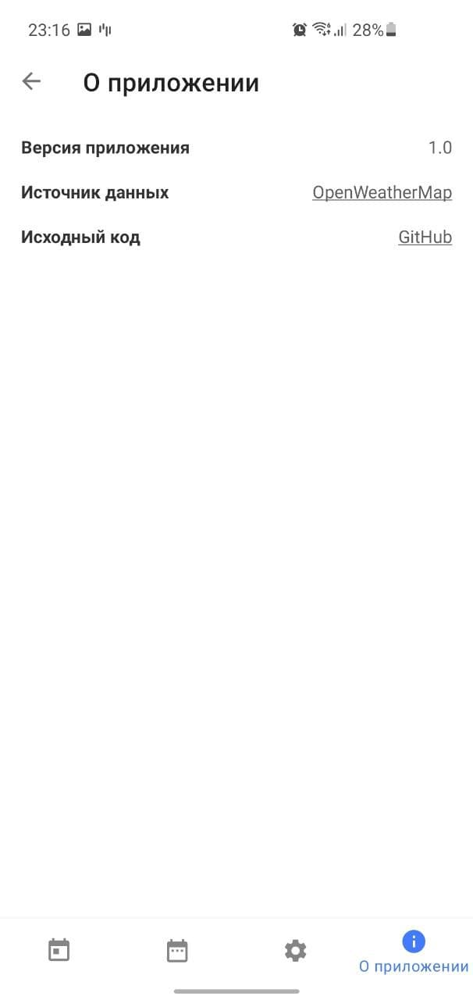
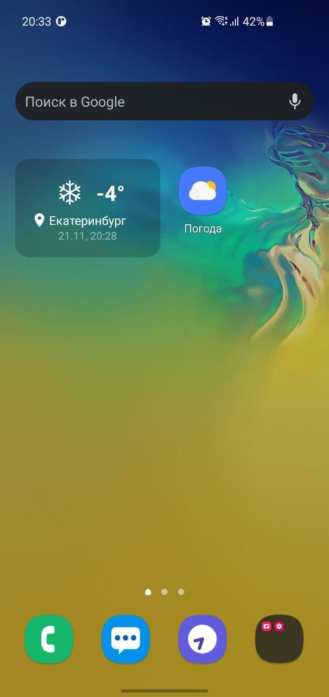

# OpenSourceWeatherApp


Погодное приложение для Android.

## Функционал приложения

Отображает текущую погоду, а также почасовой и недельный прогноз погоды. Для работы требуется доступ к геоданным (__android.permission.ACCESS_COARSE_LOCATION__).

## Виджет

Имеется возможность добавления виджета с текущей погодой на главный экран.
При добавлении автоматически активируется __WorkManager__, благодаря чему виджет будет периодически обновляться актуальными данными о текущей погоде.
Период автообновления можно задать на экране настроек (по умолчанию период автообновления 1 час).
Чтобы отменить автообновление достаточно удалить виджет с экрана.

## Используемые библиотеки

* Компоненты архитектуры Android (__ViewModel__, __LiveData__, __WorkManager__, __NavigationUI__)
* __Retrofit__
* __RxJava 2__
* __Gson__
* __Room__

## OpenApi

* В качестве источника данных о погоде используется [OpenWeatherMap API](https://openweathermap.org/api).\
Для локальной сборки приложения, чтобы получить доступ к API, требуется добавить свой api key в `local.properties`
```
openweathermap.org.api.keys="YOUR_API_KEY"
```

## Preview

|                                       |                                       |                                   |
| ------------------------------------- | ------------------------------------- | --------------------------------- |
|  |  |  |
|     |       |                                   |

## License

[](https://www.apache.org/licenses/LICENSE-2.0.html)

```
   Copyright 2021 Vitaly Zharov

   Licensed under the Apache License, Version 2.0 (the "License");
   you may not use this file except in compliance with the License.
   You may obtain a copy of the License at

       http://www.apache.org/licenses/LICENSE-2.0

   Unless required by applicable law or agreed to in writing, software
   distributed under the License is distributed on an "AS IS" BASIS,
   WITHOUT WARRANTIES OR CONDITIONS OF ANY KIND, either express or implied.
   See the License for the specific language governing permissions and
   limitations under the License.
```
